# 

> *Curious about how things work. Even more curious about how to make them better.*

I'm a Software Engineer who enjoys building backend systems, clean APIs, and automation tools that solve real problems.

My journey started with curiosity about games and websites, eventually leading me to fall in love with Python, Django, and FastAPI.

I've worked on everything from enterprise migration tools and healthcare software to freelance web applications, computer vision experiments, and AI-powered projects.

** And honestly... I'm just getting started. **

---

# 🚀 What I'm Up To

- 🔨 Building **Travelling Salesman**, a travel platform to simplify trip planning
- 🐍 Developing scalable backend services with **Python**, **FastAPI**, and **Django**
- 🤖 Exploring **AI**, **RAG**, **LLMs**, and intelligent automation
- ⚙️ Building developer tools that automate repetitive workflows
- 🏗️ Learning more about system design, cloud architecture, and distributed systems
- 📚 Always trying to write cleaner, more maintainable code than I did yesterday

---

# 🧠 Ask Me About

- Python, FastAPI & Django
- REST APIs & Backend Architecture
- PostgreSQL, SQL & Database Design
- Docker, Linux & Developer Workflows
- AI Applications, RAG & LLM Integrations
- Debugging those *"this should work..."* moments 😅

---

# 🛠️ Tech Stack

### Languages

### Backend

### Frontend

### Database

### Tools

### Currently Exploring

---

# 🌱 A Few Things About Me

- 💡 I enjoy turning ideas into products people can actually use.
- 🚀 I learn best by building.
- 🤝 I enjoy collaborating with people who love solving challenging problems.
- 🎯 I believe good software is simple, reliable, and maintainable.
- ☕ Most bugs disappear after enough coffee... *most.*

---

# 📊 GitHub Activity

  
  

 

---

# 📫 Let's Connect

💼 **LinkedIn:** https://linkedin.com/in/Sahal054

📧 **Email:** sahalmsachu@gmail.com

---

> *"The best way to learn is to build. The best way to grow is to keep building."*
